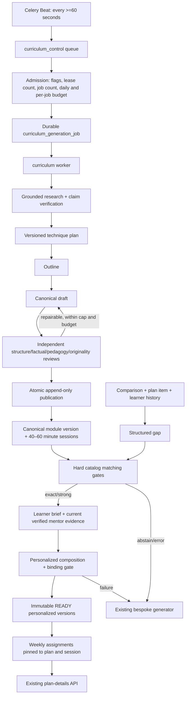

# Claude Code review handoff: evidence-based lesson factory

## Document purpose

This document explains **what changed, why it changed, the contracts the code is
supposed to preserve, and where a reviewer should be skeptical**. It describes
the current uncommitted working tree on branch
`evidence-based-lesson-factory` as of 2026-07-29.

Unless otherwise stated, code paths in this document are relative to
`cmpys/backend`; prompt paths beginning with `cmpys/prompts` and the workspace
`USER.md` path are relative to the workspace root.

Do not treat this document as proof that the implementation is correct. It is a
map for reviewing the code and tests. The runtime feature flags remain disabled
by default, so merging the branch does not by itself enable autonomous lesson
generation or catalog-first delivery.

### Review-scope warning

Most of the core implementation files are currently **untracked**, so
`git diff` alone does not show the feature. Claude must inspect both the current
filesystem and `git status --short`, including every untracked curriculum,
catalog-personalization, prompt, migration, test, and documentation file.

The workspace-level `USER.md` modification is private preference memory,
not product code. Exclude it from the code-review scope and decide separately
whether it should ever be included in a product commit.

## Executive summary

The previous lesson path did almost all expensive work after a user needed a
lesson: research, curriculum design, long-form writing, and personalization.
That made latency high and forced one request-time generation to solve two
different problems:

1. produce reusable, factually and pedagogically sound teaching material; and
2. adapt that material deeply to one learner and one mentor/idol.

This change separates those concerns:

- A durable background factory researches, writes, reviews, and publishes
  immutable **canonical module versions** before a learner asks for them.
- The request-time path resolves a structured skill gap, applies strict catalog
  compatibility gates, builds a learner brief, and creates a complete
  **personalized lesson version** from the canonical source material.
- A catalog miss, weak match, stale/revoked catalog dependency, failed
  personalization, or any internal exception falls back to the existing
  bespoke generator. Canonical source manifests themselves currently have no
  independent runtime revocation lifecycle.
- Verified mentor evidence is stored independently and can be used only when it
  is relevant, source-backed, current, and explicitly bound into the lesson.
- Exact canonical, technique, prompt, model-route, mentor-evidence, learner-state,
  and personalized-version identities are pinned so later catalog changes do
  not silently mutate an active plan.
- Mission progress is pinned to the exact detail-generation artifact, so a
  replacement lesson starts with fresh progress while retaining the prior
  artifact's completion rows as audit history.

The intended quality improvement comes from moving research and review off the
interactive path, using explicit evidence-based technique contracts, running
independent review stages, and requiring measurable personal bindings. It is
**not yet a measured production quality improvement**. Shadow and blinded
evaluation are required before enabling the flags.

## Product goals implemented

The implementation targets these product requirements:

1. Continuously prepare detailed reusable lessons in the background.
2. Allow slow research, writing, independent review, and targeted repair without
   blocking a learner request.
3. Match catalog content to skill gaps derived from comparison and plan context.
4. Preserve deep personalization rather than returning generic catalog text.
5. Respect exact weekly capacity: several sessions may fit in one week, while a
   multi-session module may continue across weeks.
6. Store and use source-backed mentor preferences, books, habits, principles,
   failures, and decision methods.
7. Use applicable evidence-based learning techniques and allow bounded external
   research.
8. Keep the existing bespoke lesson generator as the safety fallback.

## Important interpretation of “specialized agents”

The code does not create long-lived conversational agent identities. A
“specialized agent” is implemented as a bounded pipeline role with its own
prompt, schema, model tier, deterministic gates, durable checkpoint, and review
output. The roles are:

- grounded research discovery and curation;
- research-claim verification;
- learning-technique planning;
- curriculum outlining;
- long-form module writing;
- structure, factual, pedagogy, and originality review;
- targeted repair;
- mentor-evidence curation and independent verification;
- personal lesson composition.

This gives the roles durable state and independent outputs without relying on a
single long-running LLM conversation. Claude should review whether this
interpretation satisfies the desired product semantics.

## Non-goals and intentionally incomplete areas

This branch does not:

- enable either new feature in production;
- delete or replace the bespoke generator;
- add a curriculum administration UI or public management API;
- prove a real-world quality uplift;
- provide durable delivery of spaced follow-ups;
- populate or query the new vector embedding field in the default repository;
- split one 40–60 minute session across multiple weeks;
- pre-personalize every catalog lesson for every user;
- fetch and preserve primary-page text for every grounded search result;
- autonomously approve high-stakes financial material for publication.

The schema includes a 1024-dimensional embedding and HNSW index, and the matcher
accepts a semantic-score hook, but the production repository currently selects
by structured skill identity and the ordinary caller does not provide that
hook. Therefore the default runtime path is effectively exact structured
matching. Semantic retrieval is an extension point, not a completed default
feature.

## Architecture overview



### Artifact boundaries

The implementation deliberately separates three artifacts:

1. **Canonical module version**
   - Shared, reviewed curriculum.
   - Contains concepts, mechanisms, examples, practice structures,
     assessments, sources, technique bindings, and session scaffolds.
   - Is not considered ready for a learner.

2. **Learner lesson brief**
   - A bounded snapshot of demonstrated capability, gaps, prior outcomes,
     current project, goal, constraints, preferences, weekly capacity, and
     verified mentor evidence.
   - Persistent database IDs are replaced with request-scoped aliases before
     being sent to an LLM.

3. **Personalized lesson version**
   - The complete reader-facing artifact for one learner and one canonical
     session.
   - Pins learner-state and mentor-evidence snapshots, input hash, content hash,
     prompt version, route/model identity, canonical version, and session.
   - Cannot become `ready` unless the personalization and runtime gates pass.

The canonical text is treated as source material. Returning it unchanged is a
quality-gate failure.

## Database and migration changes

### New migrations

`migrations/versions/g4h5i6j7k8l9_curriculum_factory_foundation.py` is an
additive migration based on `f3g4h5i6j7k8`. It creates the curriculum enums,
tables, indexes, foreign keys, checks, and PostgreSQL triggers described below.

`migrations/versions/h5i6j7k8l9m0_fix_curriculum_ri_trigger_contracts.py` is a
forward-only repair revision based on `g4h5i6j7k8l9`. It deliberately does not
rewrite an already-applied foundation revision. It backfills the missing
canonical retrieval hash with the same compact, sorted, UTF-8 canonical-JSON
contract used by the application, restores its constraint and immutable guard,
and narrows append-only guards so PostgreSQL-owned `ON DELETE CASCADE`/
`ON DELETE SET NULL` actions can complete while equivalent direct DML still
fails. Mentor-binding reassignment validates both the old and new claim, so a
finalized binding cannot be removed by moving it to a pending claim. The
revision also creates every repaired trigger and the partial assignment index
idempotently for databases stamped with an earlier working copy of the
foundation migration.

`migrations/versions/h6i7j8k9l0m1_detail_job_wall_clock_epoch.py` versions
mission progress by the exact detail-generation artifact. It adds a wall-clock
artifact epoch and durable `supersedes_artifact` marker to detail jobs, adds a
nullable `artifact_job_id` to item and step completion history, and replaces
the old logical uniqueness indexes with paired partial indexes for legacy
`NULL` artifacts and modern non-`NULL` artifacts. It preserves a completion
only when the embedded artifact is provably the item's first detail job and
the completion timestamp is not older than that job; ambiguous rows remain
legacy history. The artifact present at migration time is a tokenless-client
compatibility baseline, while every replacement published by the new runtime
uses strict artifact identity. The migration repairs cached progress, orders
already-running replacements after the published artifact, and reopens a
completed plan only when an active replacement makes a current mission
completion non-authoritative. Its downgrade refuses to erase multi-artifact
history.

`migrations/versions/h7i8j9k0l1m2_curriculum_integrity_guards.py` closes the
remaining fail-open and audit gaps. It backfills missing per-job budgets to
zero, makes the column `NOT NULL` with a zero server default, changes
plan/session assignment uniqueness to rows whose status is not `skipped` or
`replaced` so retired history can be retained, adds the partial
`jsonb_path_ops` GIN index used by mentor invalidation, and adds database guards
that make publication, readiness, verification and revocation audit metadata
transition-safe and immutable after finalization. It also
repairs the narrowly scoped learner-state `ON DELETE SET NULL` exception. Its
downgrade preflights retained terminal assignment history before removing any
forward guards.

`migrations/versions/h8i9j0k1l2m3_curriculum_audit_shapes.py` adds insert-time
shape constraints for technique, canonical, mentor and personalized lifecycle
audit fields, freezes terminal assignment history against resurrection, and
repairs cached mission progress that was stamped before the final artifact
reader contract. Its SQL validates the complete persisted lesson shape,
explicit progressive checkpoints and the same 29 Unicode whitespace code
points used by Python `str.strip()`/`str.split()`.

`migrations/versions/h9j0k1l2m3n4_curriculum_h8_convergence.py` is the
forward-convergence revision for databases that may already have applied an
earlier working copy of `h8`. It reapplies the final constraints and assignment
trigger, rejects or repairs broken/non-canonical artifact references, and
recalculates partial/generating progress from only explicit, substantive
`ready_step_ids`. This keeps clean installs and early-stamped databases on the
same final contract without editing an applied revision.

`migrations/versions/i0j1k2l3m4n5_curriculum_usage_ledger_index.py` is a final
idempotent convergence revision for the partial functional index used by
curriculum budget reconciliation. The index originated in `g4`, but an
early-stamped database could miss it. `h10` creates it with `IF NOT EXISTS`,
while matching ORM metadata prevents Alembic from treating the intentional
index as drift. Both budget-ledger query builders include the JSONB key-
existence predicate required for PostgreSQL to prove that this partial index is
usable. The trusted constant JSONB key is rendered as a SQL literal in both the
`?` predicate and `->>` expression, while dynamic job IDs remain bound, so a
generic Psycopg prepared plan can still prove the partial predicate. Ordinary
compiled-SQL and live forced-generic `EXPLAIN` regressions protect that
relationship. Its downgrade is a no-op because `g4` owns and eventually removes
the schema contract.

The full-chain audit also repaired older, non-curriculum downgrades that blocked
a real `head -> base -> head` test. The two intake-session foreign keys now have
explicit names, and the base/profile/plan migrations drop the PostgreSQL enum
types they created. These changes do not alter the forward production schema;
they make rollback deterministic and prevent orphaned types from breaking a
fresh re-upgrade.

### New tables

| Table | What it stores | Why it exists |
| --- | --- | --- |
| `curriculum_skills` | Stable skill taxonomy, domain, lifecycle, tags | Matching needs a controlled skill identity rather than free-form lesson titles. |
| `curriculum_skill_prerequisites` | Directed skill prerequisite edges | Prerequisites are a hard compatibility rule, not an LLM suggestion. |
| `learning_technique_versions` | Versioned evidence level, source manifest, implementation contract, limitations | A lesson must pin the exact teaching-technique evidence and contract used when it was generated. |
| `canonical_modules` | Stable module identity and pointer to the current published version | Normal updates create new immutable versions while preserving a stable catalog entity. |
| `canonical_module_versions` | Content, source and technique plans, hashes, quality score, provenance, retrieval metadata, optional embedding | Auditable append-only canonical curriculum and deterministic retrieval identity. |
| `module_sessions` | Ordered 40–60 minute immutable session units | Scheduling operates on honest learner-time units rather than pretending a long module fits any week. |
| `curriculum_generation_jobs` | State, stage, lease, retry, checkpoints, semantic hashes, usage and cost ledgers | Background work must survive crashes, retries, deploys, and duplicate dispatches. |
| `module_quality_reports` | Independent review result, evidence, issues, repair instructions, reviewer model | Review output is retained separately from the writer and is append-only audit evidence. |
| `mentor_evidence_claims` | Typed mentor fact, source provenance, evidence text/hash, confidence and lifecycle | Mentor references should be factual, relevant, revocable, and reusable. |
| `mentor_evidence_claim_skills` | Claim-to-skill bindings | A verified mentor fact is still unusable when it is unrelated to the lesson skill. |
| `learner_skill_states` | Current demonstrated level, mastery, strengths, gaps, misconceptions and evidence | Personalization must be grounded in learner state rather than only a name or goal. |
| `personalized_lesson_versions` | Complete per-user lesson, canonical/session pin, snapshots, hashes, model and lifecycle | User-visible content remains reproducible and does not mutate when upstream content changes. |
| `plan_lesson_assignments` | Plan/week/position/session/personalized-version pin and completion lifecycle | Scheduling, continuation, completion, revocation and replacement need durable state. |

### Database-enforced invariants

The migration enforces important rules in PostgreSQL, not only in Python:

- Published canonical content and published technique versions are immutable.
- Publication/readiness/verification timestamps can be set only on their exact
  finalization transition. A technique's `reviewed_at` may evolve while it is
  draft/in-review but is immutable after publication. Revoke timestamps and
  reasons are set together once and cannot be rewritten later.
- Published module sessions are immutable and cannot be added after publication.
- A canonical module’s current pointer must reference its own published,
  non-revoked version.
- `retrieval_metadata_json` is protected and has a required SHA-256
  `retrieval_metadata_hash`.
- Quality reports are append-only. Deleting their generation job may clear only
  `generation_job_id` through the nested PostgreSQL FK action; direct updates
  and changes to every other report field remain forbidden.
- Verified/rejected/revoked mentor claims and their skill bindings are
  immutable except for allowed lifecycle transitions.
- Ready personalized content and its snapshots/provenance are immutable.
- Every curriculum job has an explicit non-null dollar ceiling. Missing legacy
  ceilings are migrated to zero and runtime admission also fails closed on a
  corrupt `NULL` value.
- Available, in-progress, or completed assignments must pin a personalized
  version.
- The personalized version must belong to the same user as the plan.
- A `plan_item_id` on an assignment must belong to that same plan.
- A personalized lesson/session composite pin must refer to the same canonical
  session.
- Only one assignment whose status is not `skipped` or `replaced` may exist for
  a plan/session. This includes `completed`; retired `skipped` and `replaced`
  rows remain retained without blocking a safe retry, and their terminal status
  cannot be resurrected. Other assignment fields are not claimed to be fully
  immutable history.
- Legacy mission progress has one row per logical key, while modern mission
  progress has one row per logical key and exact `artifact_job_id`; two partial
  unique indexes enforce both cases without conflating `NULL` with a new
  artifact.
- User deletion cascades through learner state, ready personalized versions,
  plans, and assignments. Privacy deletion intentionally outranks reader
  immutability.

The ORM model listeners mirror the most important append-only rules so local
failures are earlier and clearer, while PostgreSQL remains authoritative.

### Privacy-trigger nuance

`learner_state_id` uses `ON DELETE SET NULL`, while ready personalized versions
are normally immutable. The database guard permits only the nested referential-
integrity trigger transition from a non-null learner-state ID to null when all
other protected values are unchanged. A direct application update to null is
still rejected. The PostgreSQL contract test covers both the rejected direct
update and successful user cascade.

The mentor-claim skill-binding guard has a similar, narrower exception: a
missing parent is accepted only for a child `DELETE`, which is the nested
`ON DELETE CASCADE` path. Inserts and updates with no parent fail, and direct
changes to bindings of finalized claims still fail. Reassignments lock and
validate both claim IDs in UUID order, closing the finalized-claim-to-pending-
claim bypass. A finalized claim still rejects direct deletion, while deleting
its owning mentor/idol is allowed to cascade through the claim and bindings for
privacy cleanup.

`CurriculumGenerationJob.quality_reports` uses
`passive_deletes="all"`, not merely `True`. The collection is loaded with
`selectin`; ordinary `passive_deletes=True` can still make SQLAlchemy null
loaded children itself. The `"all"` setting guarantees that the database owns
the FK transition and therefore reaches the trigger's tightly scoped RI
exception.

`LearnerSkillState.personalized_lessons` now uses the same
`passive_deletes="all"` rule. Deleting an isolated learner-state row therefore
delegates its `ON DELETE SET NULL` action to PostgreSQL even when the
relationship was already loaded; the live contract verifies that a READY
lesson keeps its immutable learner snapshot while only the nullable live
pointer is cleared.

## Background generation pipeline

### Durable stages

| Stage | What changed | Why |
| --- | --- | --- |
| `taxonomy` | Checkpoints and validates a controlled module target if a job enters this stage. The current pilot control tick materializes skills/modules/technique versions before dispatch and creates seeded jobs directly at `source_research`. | Keeps the state machine capable of validating an explicit target without pretending the seeded LLM job creates its own taxonomy. |
| `source_research` | Runs grounded discovery, server-owned source classification, curation, and independent claim verification. | Writers should receive a verified source manifest instead of browsing ad hoc. |
| `technique_design` | Selects applicable versioned learning techniques and produces explicit block/runtime contracts. | Naming “retrieval practice” is insufficient; the lesson must implement it observably. |
| `outline` | Produces a schema-validated block and time plan tied to the target, sources, and techniques. | Prevents a writer from silently changing outcome, level, artifact, or duration. |
| `writing` | Produces the complete canonical module; later failures can request a targeted repair. | Long writing is reusable background work and should not occupy an interactive queue. |
| `factual_review` | Independent review against verified source/claim bindings. | The writer cannot approve its own factual output. |
| `pedagogy_review` | Independent review of technique implementation, practice, feedback and assessment. | Useful structure must be verified separately from prose quality. |
| `originality_review` | Binds the review to the complete bounded corpus hash, but sends at most 20 comparison texts to the semantic LLM reviewer. Publication later runs the deterministic shingle gate against every entry in the complete corpus of at most 100. | Bounds the review prompt while ensuring publication does not silently ignore a current catalog entry. |
| `publish` | Re-runs deterministic gates and atomically writes the immutable version, sessions, reports and current pointer. | No partially reviewed or partially persisted module may become visible. |

### State, leases and recovery

Durable jobs use `queued`, `running`, `retry_wait`, `completed`, `failed`,
`flagged`, and `cancelled` states. The control worker:

- runs from Celery Beat at a minimum 60-second cadence;
- honors `CURRICULUM_ENABLED` before seeding or dispatching;
- materializes the pilot taxonomy, module identities and technique versions
  before it creates/dispatches seeded jobs at `source_research`;
- acquires database leases with owner and expiration fields;
- limits dispatches per tick and concurrent running jobs;
- resumes from validated stage checkpoints;
- requeues retryable failures with exponential backoff from one minute to one
  hour;
- consumes one attempt for every expired lease, including ordinary curriculum
  jobs as well as mentor jobs, and terminally fails a job when the recovered
  lease reaches `max_attempts`;
- stops after configured attempts/repairs or flags insufficient-quality work;
- treats a disabled feature flag as a kill switch between paid stages;
- does not trust a stale worker lease at publication time.

Every checkpoint has a stage-input hash built from canonical JSON and explicit
dependencies. A changed target, prompt, route, model, technique registry,
pilot definition, source/mentor corpus, or upstream checkpoint invalidates the
semantic recipe instead of reusing stale work.

### Model routing and cost controls

The default tiers are:

- research/classification: `fast`;
- outlining and long-form writing: `balanced`;
- independent review/escalation: `quality`.

The exact resolved provider, primary/fallback model, prompt content hashes,
endpoint fingerprint (never the credential), and generation recipe are persisted
or hashed into identity. This prevents a provider or prompt change from being
mistaken for the same immutable generation.

The per-job dollar cap is snapshotted onto the durable job when it is created.
A later configuration change does not retroactively rewrite an existing job’s
admission contract. A missing persisted cap is treated as corrupt state and
cannot authorize another paid stage.

Default autonomous internal-accounting limits are:

- `$0.20` estimated curriculum cost per UTC day;
- `$0.60` estimated cost per durable job;
- 8 admitted jobs per UTC day;
- 2 running curriculum/mentor leases;
- 1 dispatch per control tick;
- up to 2 targeted repairs.

The daily controller uses an 85% soft-admission threshold: new paid work is not
admitted when current estimated cost plus durable reservations and the next
stage reserve would exceed that threshold. The remaining headroom is for
in-flight estimate error; `$0.20` is a hard threshold for the internal
estimate-based status/accounting logic, not a hard provider-billed-spend ceiling.

The two-repair value is a ceiling, not a spending entitlement. With current
conservative reserves, an initial pass plus two full repairs would reserve
`$0.635`, so the default `$0.60` cap intentionally stops the later repair.

Daily admission counts estimated cost from:

- persisted LLM usage telemetry;
- current running-lease stage reserves; and
- unreconciled durable attempt reserves from failed or crashed jobs that are no
  longer in `running` state.

Telemetry is subtracted from conservative attempt gaps and the current lease is
deduplicated. Old reserves do not carry into another UTC day. Telemetry uses
local price-card estimates and its persistence is best-effort. This remains a
soft admission guard around real billing: an in-flight provider call can finish
above its estimate, missing telemetry can reduce accounting completeness, and
later stages—not the provider invoice—are what stop or defer.

## External research and source safety

The new research path uses grounded search and then applies server-owned checks:

1. Search/provider output is treated as untrusted data.
2. Only direct HTTP/HTTPS resource URLs on ports 80/443 are eligible.
3. DNS must resolve entirely to globally routable addresses.
4. The availability check connects to a prevalidated IP while preserving Host
   and TLS SNI, preventing a second DNS resolution from introducing a rebinding
   target.
5. Environment proxies are disabled and every redirect hop is revalidated.
6. The server, not the curator model, classifies source type and evidence tier.
7. Instruction-like source text, control characters, and delimiter tricks are
   neutralized before a writer prompt.
8. The sanitized support content is rehashed after sanitization.
9. Factual teaching blocks must bind to known verified claim IDs and supporting
   source IDs.
10. Independent claim verification requires an entailment score of at least
    `0.80` plus a verification note.

The writer receives only a bounded sanitized manifest. Paid or copyrighted
sources are `citation_only`; the system links and synthesizes rather than asking
the model to reproduce them.

### Important source limitation

The live research path currently stores provider-grounded support spans from the
grounded response. It does **not** fetch and preserve a verbatim primary-page
excerpt for every final URL. The URL resolver proves direct/public reachability,
not page-level semantic equivalence. For factual or financial curriculum,
unsupervised publication should remain disabled until URL-context retrieval or a
human source audit confirms that the grounded synthesis faithfully represents
the cited page.

## Evidence-based learning techniques

The pilot registry contains 11 versioned techniques with evidence tier, direct
sources, applicability, implementation requirements, and limitations:

1. retrieval practice;
2. spaced practice;
3. worked examples;
4. guidance fading;
5. self-explanation;
6. interleaving;
7. active application;
8. feedback and revision;
9. mastery checks;
10. concrete–abstract linking;
11. aligned visual and verbal explanation.

The quality gates validate observable implementation. Examples:

- retrieval must require an attempt before showing feedback;
- worked examples require complete reasoning and linked principles;
- guidance fading requires worked, partially guided, and independent practice;
- active application must produce a decision or artifact;
- feedback must require a revision, not only a score;
- spaced practice must have concrete follow-up days and a durable delivery
  capability.

`CURRICULUM_DURABLE_SPACING_SCHEDULER_ENABLED` defaults to `false`. A module that
requires later-day delivery cannot publish while this capability is disabled.
This prevents the catalog from claiming a technique that the product cannot
actually deliver.

## Pilot scope

The deterministic pilot is versioned as `pilot-2026.1` and contains 20 English
skills across two domains:

- investing: financial statements, intrinsic value, margin of safety, circle of
  competence, business quality, moat analysis, capital allocation, risk,
  investment thesis, and decision journaling;
- entrepreneurship: problem discovery, customer interviews, hypothesis design,
  value proposition, MVP scoping, experiments, pricing, unit economics,
  distribution, and product metrics.

Each skill has a stable key, level, outcome, prerequisites, total-time estimate,
priority, and content-derived identity hash. The pilot and technique registry
are application manifests, not migration seed data. They are materialized
idempotently only when curriculum generation is enabled.

## Catalog matching

The request-time resolver first tries deterministic metadata from the plan item
and comparison. When necessary, a closed-world classifier may select only from
the known database skill set; it cannot create a new skill identity. The
candidate set is read in deterministic pages of 100 and every page is
classified independently before the best supported selection is chosen. The
page size is a prompt bound, not a hidden first-100 retrieval cap.

Every candidate must pass these non-negotiable gates:

- current published/non-revoked canonical version;
- current published/non-revoked pinned technique versions;
- valid retrieval metadata hash and technique manifest hash;
- quality score at least `0.80`;
- exact skill and target level;
- satisfied prerequisites;
- compatible language/locale;
- required artifact type;
- declared outcome or controlled alias;
- at least one schedulable session within available time;
- valid direct source materials; and
- an implementable spacing contract.

An exact outcome and exact locale produce an `exact` verdict. A caller-supplied
semantic score of at least `0.82` may produce `strong` only after every hard gate
passes. Embeddings or similarity can retrieve/rank; they can never waive a hard
compatibility rule. The ordinary production caller currently does not provide a
semantic hook, which is why default behavior should be reviewed as exact
structured matching.

## Deep personalization

The learner brief combines bounded facts from:

- learner profile and learning preferences;
- user goal and real project;
- structured comparison gap;
- demonstrated skill state, strengths, gaps and misconceptions;
- prior lesson or plan outcomes;
- exact weekly capacity and constraints; and
- verified, non-revoked, skill-relevant mentor evidence.

The personal composer must produce a complete lesson with required headings,
worked example, failure modes, guided practice, artifact, understanding check,
rubric, substantive substeps, and approved source references. The resulting
reader content must remain within the existing `1900–4200` word quality range.

Personalization is mechanically checked through declared fact bindings across
five dimensions:

- explanation;
- worked example;
- practice;
- user artifact;
- success rubric.

Every dimension must use at least one learner/goal/comparison/mentor fact. The
whole lesson must use at least three unique facts and at least one learner fact.
The declared anchor must appear in both the referenced brief fact and the
corresponding lesson section. Canonical-only output, unknown IDs, invented URLs,
unsourced mentor names, and mentor-evidence mismatches are rejected.

When the brief contains verified mentor evidence relevant to the selected
skill, at least one composed session must actually bind and cite that evidence.
The rule is enforced on fresh composition, cache reuse, exact assignment pins,
and runtime delivery; silently omitting all relevant mentor evidence is not a
valid “personalized” lesson. A brief with no relevant evidence remains valid
and is not forced to invent a mentor reference.

The canonical-copy detector now extracts the complete learner-visible session
shape (session title/objective, block titles/content/instructions/success
criteria, assessment blocks, artifact/rubric prose, and technique-plan
narrative). It tokenizes spaced scripts by Unicode word and unspaced scripts by
character, then combines phrase shingles with exact bit-parallel ordered LCS
coverage in both directions. This rejects full copies with padding or inserted
tokens, repeated-token copies, non-Latin copies, and a shorter lesson copied
from one subsection of a longer reference without reducing the comparison to a
false-positive-prone bag-of-words score. Canonical personalization, catalog
originality, and external-source originality use the same strengthened
primitive with their own thresholds and short-source exemption.

Free-form title and narrative fields are parsed, but never rendered, by the
pinned `markdown-it-py` CommonMark AST with raw-HTML recognition enabled and
linkification disabled. The gate rejects parser-confirmed links, images,
reference definitions, URI/email autolinks, bare destinations, and
network/execution-capable HTML tags, attributes, events, styles, or data.
`HTMLParser` inspects only parser-confirmed HTML tokens. Code/fence tokens,
escaped markup, well-formed comments, processing instructions, declarations,
and entity-encoded inert syntax therefore remain inert instead of being
recreated by global entity decoding. CDATA and browser-ambiguous abrupt-comment
forms fail closed because their browser parsing differs from Python's HTML
parser. Parser errors also fail closed. The title is both validated and escaped
before Markdown rendering.

Raw persistent IDs are not placed in the LLM prompt. The prompt uses scoped
aliases and only the validated output is mapped back to stored IDs.

### Request-time latency tradeoff

Research, canonical writing, and canonical review are removed from the user
path. Final personal composition is still an LLM operation at first use unless
an exact ready version is already cached or pinned. Selected sessions compose
with bounded concurrency of 2. Therefore this design should materially reduce
work on the request path, but it does not make every first personalized lesson a
zero-LLM database read.

The cache identity includes the learner brief, canonical/session IDs, composer
and gate versions, exact rendered-prompt digests, resolved provider/model route,
system prompt, and routing version. A changed prompt or model route appends a
new personalized version rather than overwriting a ready one.

## Mentor/idol evidence

Mentor facts are typed as recommended book, habit, decision method, principle,
failure, learning method, or preference. A claim must have:

- a mentor owner;
- normalized semantic hash;
- source chunk or direct source URL;
- evidence text and source hash;
- relevant skill binding;
- confidence and independent verification lifecycle.

The curation job hashes the authoritative source corpus, verifies it before
each paid call, and locks/rechecks the final corpus before persistence. A new
source version creates append-only evidence; an authoritative new run revokes
previous verified claims that are no longer represented. Revocation invalidates
dependent ready personalized lessons and active assignments.

At composition time only verified, non-revoked claims with confidence at least
`0.70` and relevant skill bindings enter the brief. The final persistence path
locks and revalidates the complete evidence set so a concurrent revoke cannot
publish a stale personalized lesson.

## Weekly scheduling and progression

Canonical drafts are packed into immutable 40–60 minute sessions. Request-time
scheduling:

- uses the user’s available minutes for each plan week;
- subtracts existing commitments;
- may place several sessions in one week when capacity permits;
- may continue later sessions of one module in later weeks;
- never repeats the same module-version/session identity;
- skips already completed, replaced, or explicitly skipped work correctly;
- persists exact week, position, allocated time, comparison gap, match reason,
  canonical session, and personalized version.

The implementation does not split a single session across weeks. If the user
cannot fit the smallest 40-minute session, catalog scheduling abstains and the
existing path remains available. “The same lesson across several weeks” is
implemented as sequential sessions of the same module, not by showing the same
completed session again.

Plan-item and step completion now synchronize only the corresponding pinned
assignment. Completion verifies plan ownership, plan-item ownership, user
ownership, ready status, revocation state, and the exact personalized version
embedded in the delivered step.

Both item and step toggles acquire the catalog dependency locks before the
`PlanItem` lock, then reread completion rows under `FOR UPDATE`. The `PlanItem`
lock serializes the missing-completion insert case and item-vs-step progress
reconciliation. Exact assignment coverage is required, terminal
`skipped`/`replaced` assignments cannot be resurrected, and a revoked pin or
other lifecycle race becomes a stable client-facing `409` without partially
mutating local completion state.

For both catalog and bespoke lessons, completion rows are now scoped to the
exact detail artifact. The detailed response exposes `artifact_job_id`; modern
clients echo it as the `artifactJobId` query parameter on item/step toggles.
Legacy artifacts whose `_generation.job_id` key is truly absent continue to use
the legacy `NULL` identity. A current modern marker must be canonical lowercase
hyphenated UUID text and resolve to a retained `PlanItemDetailJob` for the same
plan item and plan owner. A present null, empty, padded, upper-case, braced or
unhyphenated UUID, non-object `_generation`, missing job, wrong-item job,
wrong-owner job, or authoritative newer replacement fails closed. The
referenced job's operational queue status is deliberately not reader
authority: the immutable delivered artifact metadata and replacement ordering
decide whether progress is current. Tokenless compatibility is retained only
for the first usable modern artifact; a durable `supersedes_artifact` marker
requires the token for every real replacement.

Progressive artifacts are counted without pretending hidden work is ready.
For `_generation.status` `partial` or `generating`, `total_steps` remains the
complete strictly parsed step list, while completed IDs and the numerator are
limited to an explicit, unique, canonical, in-artifact `ready_step_ids` subset
whose exposed steps each contain at least 1,900 words. Missing, non-array,
empty, duplicated, padded, overlong or unknown checkpoint IDs fail closed;
failed or unknown generation statuses contribute zero. `ready` and preserved
`revoked` reader artifacts use the full valid step set. A truly legacy,
statusless artifact remains fully readable, while an explicitly partial legacy
artifact still uses checkpoint filtering even when it has no job marker.
Item-level modern completion is authoritative only for `ready` or `revoked`
artifacts, so a progressive checkpoint can advance an item only to
`IN_PROGRESS` and at most 99%.

Publishing the first checkpoint of artifact B resets the cached item status and
progress in the same transaction. For a mission artifact only, it also clears
`plan.completed_at` when the plan has no successor, while preserving the
completion stamp once a successor cycle exists. Historical completion rows for
artifact A remain available for audit but cannot complete, advance, or
calculate progress for B.

The current job row referenced by a delivered artifact is therefore retained
even after its operational state is terminal. Cleanup may prune only
superseded, unreferenced detail jobs; deleting a referenced row would
intentionally make the artifact fail closed and is not a valid housekeeping
operation.

## Runtime visibility, pinning and revocation

A plan detail marked `catalog_personalized` is visible only if the database still
confirms all of the following:

- all expected personalized versions exist, belong to the user, are `ready`,
  have recomputed content, learner-state and mentor-evidence hashes that match
  their stored digests, and are not revoked;
- every expected plan assignment belongs to the plan item and pins the expected
  personalized/session pair in an active visible state (`available`,
  `in_progress`, or `completed`); terminal `skipped`/`replaced` history does not
  make content visible;
- canonical versions are still published and not revoked;
- retrieval metadata and technique manifests still hash correctly;
- every pinned technique version remains published and non-revoked; and
- every cited mentor claim remains verified, non-revoked, and owned by the
  expected mentor.

For a modern detail artifact, the embedded job ID must also resolve to a job
owned by the same user and plan item, and no authoritative later active job may
be replacing it. Latest-job authority uses `artifact_epoch_at` (a PostgreSQL
wall-clock value) and UUID tie-breaker across every job status, not transaction
start timestamps or “latest active row” in isolation.

Normal catalog publication does not move an active plan off its immutable pins.
An explicit critical revoke is atomic:

1. lock the pinned technique versions;
2. lock and refresh the canonical module;
3. lock and refresh the requested canonical version;
4. detach the current pointer only when it still points to that version;
5. mark the requested version revoked without overwriting earlier revoke audit
   metadata;
6. revoke dependent ready personalized versions;
7. skip active assignments; and
8. mark plan detail metadata revoked so the next open requests a replacement.

If a newer publication became current concurrently, revoking an older version
does not retire or detach the newer version.

Revocation is sticky history, not a transient worker failure. A valid delivered
artifact marked `revoked` can retain its exact prior completion history for
audit/progress continuity, but the catalog readiness checks still prevent it
from being newly served or assigned. Publishing an authoritative replacement
suppresses that older artifact everywhere; no revoked row can regain current
authority merely because its detail job later changes operational status.

## Concurrency and lock-order contracts

The implementation has explicit lock orders because assignment triggers and
revocation paths reread related rows.

### Assignment mutation order

All shared assignment mutations use:

1. `PersonalizedLessonVersion` IDs ascending;
2. distinct `Plan` IDs ascending;
3. `PlanLessonAssignment` IDs ascending;
4. `PlanItem` IDs ascending.

The helper probes dependencies with autoflush disabled, acquires the complete
lock set in that order, then validates that ownership and dependencies did not
change. The exact-pin path locks the full sorted personalized-version set
without lifecycle filters and checks ready/revoked/owner/module state in Python.
This avoids a partial stale set causing a `B -> A` relock inversion against an
ordinary `A -> B` writer.

Completion endpoints enter that same order before touching completion rows.
They refresh `PlanItem`, `PlanItemCompletion`, and
`PlanItemStepCompletion` only after the serialization point. The whole
assignment/completion/progress update commits once, which closes both duplicate
insert races and the previous item-toggle/step-toggle lost update window.

### Publication and revocation order

Originality publication first obtains a transaction-scoped advisory lock, then
rechecks the complete current corpus. Technique-version locks precede canonical
module/version locks in catalog revocation and exact-pin paths. Mentor and
personalized dependencies are locked before assignment mutation. Review any new
writer against these existing orders; an individually sorted query is not enough
if a later helper reacquires an earlier lock class.

The intended broader orders are:

- curriculum seeding/worker preparation: sorted `CurriculumSkill` rows, then
  sorted `LearningTechniqueVersion` rows, then sorted `CanonicalModule` rows;
- exact catalog pin: techniques, canonical module, canonical version, mentor
  claims, all personalized IDs, plan, assignments, then plan item;
- mentor publication/invalidation: durable marker, idol/skill context, all
  source rows/chunks, mentor claims, personalized derivatives, plans,
  assignments, then plan items.

Detail-artifact publication has a separate fencing contract:

1. lock the owning `Plan`;
2. lock and refresh the owned `PlanItem`;
3. select and lock the latest detail job across all statuses by wall-clock
   artifact epoch and ID; and
4. publish only when that exact row is still the caller's `running` job.

The guard runs before catalog publication, every semantic bespoke checkpoint,
and final publication. If worker A times out while inside an LLM/network call
and retry B is created, A can no longer write A's checkpoint, overwrite B, or
revive its failed job. A later generic exception first rolls back attempted
artifact/plan changes, then conditionally marks the job failed only if it is
still the active authoritative row.

The assignment database trigger itself reads plan, personalized lesson, and plan
item rows with `FOR SHARE`, while application writers prelock
`Personalized -> Plan -> Assignment -> PlanItem`. Every assignment writer must
therefore go through the shared helper. An unmediated insert/update is the most
likely entry point for a trigger/application deadlock.

## Integration with the existing plan flow

`app/tasks/plans.py` tries catalog-first delivery only when
`LESSON_CATALOG_FIRST_ENABLED` is true. It:

1. loads the same user, plan, comparison, project and mentor context used by the
   existing generator;
2. reports the `matching_catalog_lesson` progress state;
3. runs matching, scheduling, personal composition and persistence in a nested
   transaction/savepoint;
4. writes the complete catalog-personalized details and immutable pin metadata
   only when every session is ready; and
5. returns through the existing completed detail-job contract.

On abstention, the bespoke generator continues normally. On any catalog
exception, the outer transaction is explicitly rolled back and the plan item
and job are refreshed before fallback. This prevents released savepoint writes
from being accidentally committed by the next bespoke progress update.

`app/api/v1/plans.py` adds database-backed readiness checks before serving,
completing, retrying or prefetched-reusing catalog content. A revoked catalog
artifact is treated as explicit invalidation and may automatically enqueue a
replacement rather than being mistaken for an ordinary permanently completed
job.

Generic plan-item GET, plan/current-plan responses, daily execution focus,
weekly summaries, and plan reconciliation all derive completion from the same
exact-current-artifact predicates. While authoritative replacement B is active,
artifact A cannot keep a mission or plan complete. `PATCH /plan-items/{id}` is
now notes-only with Pydantic `extra="forbid"`; status/progress writes must use
the serialized completion endpoints and old callers attempting direct progress
mutation receive `422` instead of creating contradictory cached state.

Manual plan-item creation persists the item and its first detail job in one
database transaction before dispatch. Detail GET refreshes the item under lock
and recomputes progress if a worker published a different artifact while the
request waited.

The base plan is still generated by the existing planner. Catalog matching and
assignment occur during plan-item detail generation/open/prefetch, not while the
top-level plan skeleton is initially constructed.

## Prompt and provenance changes

The prompt registry now includes separate files for:

- grounded research discovery, curation and verification;
- technique planning;
- outline;
- module writing and repair;
- structure, factual, pedagogy and originality review;
- mentor claim curation and verification; and
- shared research/writer system boundaries.

`prompt_loader.py` declares the exact allowed placeholders and groups them in a
`curriculum` registry. Exact loaded prompt content is hashed into the generation
recipe. The personal composer has a hard-coded prompt builder, so its fully
rendered prompt digest is also included in the cache identity; changing only a
manual version constant is not required to invalidate stale cache rows.

## Deployment and configuration changes

### New feature flags

| Setting | Default | Purpose |
| --- | --- | --- |
| `CURRICULUM_ENABLED` | `false` | Allows pilot seeding, autonomous leasing and curriculum processing. |
| `LESSON_CATALOG_FIRST_ENABLED` | `false` | Tries reviewed catalog composition before bespoke generation. |
| `CURRICULUM_DURABLE_SPACING_SCHEDULER_ENABLED` | `false` | Allows publication of modules that require later-day retrieval delivery. |

### Worker topology

Two dedicated queues and worker roles were added:

- `curriculum_control`: one responsive control/revocation worker;
- `curriculum`: two bounded prefork execution slots by default.

Celery Beat dispatches the control tick. Local startup, Docker entrypoint,
production Compose, deploy service lists, and worker health checks now include
both roles. They are isolated from user-visible default/high/low queues so long
research and review calls do not consume interactive worker slots.

The complete `.env.example` can now be loaded through `Settings` with
`extra=forbid`; existing shell-only Celery/catalog worker knobs were modeled in
`config.py` to preserve typo detection without rejecting the checked-in example.

## File-by-file inventory

### New production files

| File | What and why |
| --- | --- |
| `app/models/curriculum.py` | ORM enums, 13-table model graph, relationships, indexes/checks, lifecycle defaults, and ORM immutability listeners. |
| `app/schemas/curriculum.py` | Public/persistence-facing strict request/read contracts for skills, jobs, reviews, mentor claims, learner state, personalized lessons and lifecycle. |
| `app/services/curriculum/schemas.py` | Strict internal LLM/pipeline artifacts: evidence, claims, technique plan, blocks, outline, draft, review and mentor verification. Kept separate so provider output does not become a database contract accidentally. |
| `app/services/curriculum/hashing.py` | Canonical JSON and SHA-256 identity/stage hashing. Hashes are path-independent and invalidate when semantic content changes. |
| `app/services/curriculum/security.py` | Untrusted source sanitization, instruction-neutralization, post-sanitization hashing, and the only writer source-pack shape. |
| `app/services/curriculum/research.py` | Grounded discovery, deterministic source classification, SSRF/DNS-rebinding-safe URL resolution, curation, claim verification and manifest assembly. |
| `app/services/curriculum/pilot.py` | Versioned 20-skill pilot taxonomy and 11-technique evidence registry. |
| `app/services/curriculum/generation.py` | Model calls and cross-stage assertions for technique plan, outline, draft, repair and independent reviews. |
| `app/services/curriculum/gates.py` | Deterministic source, target, structure, technique, originality and publication gates. |
| `app/services/curriculum/sessions.py` | Packs canonical blocks into honest 40–60 minute sessions. |
| `app/services/curriculum/transitions.py` | Pure stage transitions, repair ceiling and retry delays. |
| `app/services/curriculum/budget.py` | Curriculum-only daily/job admission, stage reserves, authoritative telemetry reconciliation and crashed-attempt ledger; both job-ledger queries imply the h10 partial-index predicate. |
| `app/tasks/curriculum.py` | Celery control/process/revoke/mentor tasks, durable leasing/checkpoints, recipe pins, publication, invalidation and usage reconciliation. |
| `app/services/planning/catalog_lessons.py` | Gap resolution, catalog repository, hard matching, scheduling, learner brief, personal composition/gates, cache/pins, assignment locks, readiness and revocation. |
| `app/services/planning/artifact_identity.py` | Shared exact-artifact parsing and SQL predicates for legacy/modern completion identity and authoritative active-replacement suppression. |
| `migrations/versions/g4h5i6j7k8l9_curriculum_factory_foundation.py` | Additive PostgreSQL schema, HNSW index, constraints and trigger-level invariants. |
| `migrations/versions/h5i6j7k8l9m0_fix_curriculum_ri_trigger_contracts.py` | Forward repair for canonical retrieval hashes/guards, mentor/idol and binding cascades, old-and-new binding validation, quality-report FK actions, and idempotent trigger/index reconciliation for already-stamped databases. |
| `migrations/versions/h6i7j8k9l0m1_detail_job_wall_clock_epoch.py` | Wall-clock artifact identity, append-only per-artifact completion history, cached-state repair and safe downgrade refusal. |
| `migrations/versions/h7i8j9k0l1m2_curriculum_integrity_guards.py` | Fail-closed budgets, lease/history/audit integrity, non-retired assignment uniqueness, mentor invalidation GIN index and RI repair. |
| `migrations/versions/h8i9j0k1l2m3_curriculum_audit_shapes.py` | Insert-time lifecycle audit shapes, terminal assignment protection and strict repair of pre-contract artifact progress. |
| `migrations/versions/h9j0k1l2m3n4_curriculum_h8_convergence.py` | Forward convergence for early-stamped h8 databases, canonical artifact ownership and progressive-checkpoint repair. |
| `migrations/versions/i0j1k2l3m4n5_curriculum_usage_ledger_index.py` | Idempotent forward convergence for the partial curriculum usage-ledger lookup index. |
| `docs/curriculum_factory.md` | Short operational architecture, artifact and rollout contract. |
| `cmpys/prompts/curriculum_*.txt` | Role-specific research, writing, repair, review and mentor prompts. |

### Modified production and operations files

| File | What and why |
| --- | --- |
| `app/tasks/plans.py` | Optional catalog-first detail generation, transactional fallback, stale-worker publication fencing, exact-artifact reset/reconciliation, ready persistence and DB-backed prefetch safety. |
| `app/api/v1/plans.py` | Runtime readiness/revocation checks, exact-artifact OCC, authoritative response progress, notes-only PATCH and exact assignment completion synchronization. |
| `app/api/v1/daily_tasks.py` and `app/services/planning/progress.py` | Execution focus and aggregate progress use the same exact-current-artifact predicates as plan endpoints. |
| `app/models/item_detail_job.py` and `app/models/plan.py` | Wall-clock artifact epochs, durable replacement marker and per-artifact completion identity/indexes. |
| `app/models/llm_usage_event.py` | Mirrors the curriculum usage-ledger functional/partial index in ORM metadata so migrations and autogenerate agree. |
| `app/schemas/plan.py` and `docs/API.md` | Response artifact token, `artifactJobId` mutation contract and notes-only item update schema. |
| `app/api/v1/jobs.py` | User-facing progress narrative for catalog matching. |
| `app/core/config.py` | Safe-off flags, concurrency, lease, model-tier and budget settings; complete dotenv schema. |
| `app/core/celery.py` | Task discovery, dedicated routing and Beat control schedule. |
| `app/models/__init__.py` | Registers/exports the new ORM graph so mapper configuration and metadata discovery are complete. |
| `app/services/llm/prompt_loader.py` | Curriculum prompt placeholders, grouping and validation. |
| `.env.example` and `README.md` | Operational defaults, worker commands and rollout documentation. |
| `requirements.txt` | Pins `markdown-it-py==4.2.0` and its `mdurl==0.1.2` dependency so the safety gate follows one reproducible CommonMark tokenization contract. |
| `docker-entrypoint.sh`, `deploy.sh`, `../infra/deploy.sh`, `../infra/docker-compose.prod.yml`, `../../start_app.sh` | Start, isolate, monitor and roll back the new worker roles alongside existing services. |
| `migrations/versions/4e91b83a38a2_add_guided_learning_phase.py`, `5f9760a07a67_add_session_phase_and_agentic_columns.py`, `8468ba01368f_init.py`, `f036cafdc9d3_add_idol_profiles_idol_timeline_events_.py`, and `d9ebecb11d6e_add_user_achievements_plans_notes_chat_.py` | Name historical foreign keys and drop their owned enums so the complete Alembic chain can round-trip to base and back without anonymous-constraint or duplicate-type failures. |
| Workspace `USER.md` | Private preference memory, unrelated to application runtime. Exclude it from Claude’s product-code review and consider leaving it out of the product commit. |

### New and modified tests

| File | Main coverage |
| --- | --- |
| `tests/test_curriculum_models.py` | Enum/default stability, provenance columns/indexes, immutable lifecycle, finalized evidence, and ORM delegation of database FK actions. |
| `tests/test_curriculum_schemas.py` | Exact strict schemas, duplicate rejection, duration consistency, source/claim bindings and personalized mentor restrictions. |
| `tests/test_curriculum_migration.py` | g4–h10 revision chain, additive schema, safe backfills/downgrades, h8/h9/h10 convergence, ORM/index parity, full offline base downgrade cleanup, trigger/index presence and offline Alembic SQL. |
| `tests/test_curriculum_postgres_contracts.py` | Six real PostgreSQL contracts covering h8 repair, h9 convergence, live usage-index plans, triggers/indexes, direct-DML rejection, lifecycle audit immutability, assignment history, DB-/ORM-driven FK actions, cross-user/plan ownership and privacy cascade; together with `tests/test_catalog_migration.py`, the live matrix is seven tests. |
| `tests/test_curriculum_pipeline.py` | Hashes, pilot registry, source safety, gates, repair/budget logic, compiled partial-index predicates, crash ledger, routing/recipe pins, mentor races, revocation and Celery routes. |
| `tests/test_catalog_personalization.py` | Matching, scheduling, binding quality, active Markdown/HTML rejection, Unicode/padding-resistant canonical-copy detection, prompt privacy, cache identity, lock order, exact pins, capacity, fallback rollback and concurrent revoke gates. |
| `tests/test_catalog_runtime_visibility.py` | Fail-closed delivery, technique/mentor revocation, derivative invalidation and idempotent concurrent canonical revoke. |
| `tests/test_deployment_contract.py` | Worker topology, shell syntax, health checks, safety settings and `.env.example` parsing. |
| `tests/test_plan_progression_regressions.py` | Exact artifact OCC/history, malformed markers, replacement progress/plan reconciliation, stale-worker fencing, aggregate consumers, PATCH/GET authority, assignment conflicts and toggle serialization. |

## Significant review findings already fixed

An independent P0/P1 review found and drove fixes for these issues:

| Risk found | Fix applied | What Claude should recheck |
| --- | --- | --- |
| Ready lesson deletion conflicted with `ON DELETE SET NULL`, blocking privacy deletion. | Narrow RI-trigger exception plus live cascade test. | Direct updates must still fail; user deletion must remove all user artifacts. |
| An assignment could reference a plan item owned by another plan. | Database trigger validates `plan_items.plan_id = assignment.plan_id` on insert/update. | Test both insert and `plan_item_id` update paths. |
| Retrieval metadata could drift without an independently checked digest. | Required immutable `retrieval_metadata_hash` persisted and validated at selection/runtime. | Ensure every construction path hashes the exact stored JSON. |
| Different assignment writers acquired overlapping rows in inconsistent orders. | Shared `Personalized -> Plan -> Assignment -> PlanItem` helper with no-autoflush probe. | Look for any mutation bypassing the helper. |
| A partially stale exact-pin query could lock only later ID `B` then relock `A -> B`. | Lock full sorted pin set without lifecycle filters; validate lifecycle in Python. | Review partial/missing/owner-changed branches for hidden relocks. |
| ORM identity-map state could remain stale during concurrent canonical revoke. | Locked rereads use `populate_existing=True`; repeat revoke preserves original audit metadata. | Verify no stale pre-read overwrites `revoked_at` or reason. |
| Revoking a technique did not initially hide every derived catalog path. | Technique manifests are checked at SQL selection, cache use, exact pin, pre-paid composition, persistence and runtime visibility. | Verify fail-closed behavior when one technique row is missing/revoked/changed. |
| Hard-coded personal composition prompt changes were absent from cache identity. | Hash every exact rendered session prompt. | Verify private prompt text is not persisted, only its digest. |
| A crashed paid attempt could disappear from the global daily budget after leaving `running`. | Count today’s durable unreconciled attempt gap, subtract telemetry and dedupe current leases. | Exercise `retry_wait`, `failed`, delayed telemetry and UTC rollover. |
| Raising the job budget to fund two repairs violated the agreed `$0.60` limit. | Restored `$0.60`; documentation states two repairs are only a ceiling. | Ensure no config/deploy default still says `$0.70`. |
| Post-persistence duration normalization could change content after hashing. | Normalize before persistence and return a deep copy of the exact stored detail. | Ensure no caller rewrites a READY step before serving it. |
| Item/step completion could update the wrong catalog assignment. | Filter by plan, plan item, exact personalized version and owner under shared locks. | Test multi-session item completion and step uncompletion. |
| Concurrent toggles read completion state before serialization, allowing duplicate inserts or a lost item/step update; retired assignments could also be resurrected. | Lock the complete catalog scope and `PlanItem` first, reread completion rows under `FOR UPDATE`, require exact non-retired coverage, and commit reconciliation once. | Exercise same-item double toggles, item-vs-step interleavings, missing rows, and `skipped`/`replaced` rows. |
| Catalog lifecycle failures could escape as `PersonalizationQualityError`/500 during completion or mutate local completion state after revocation. | Convert the typed domain conflict at the API boundary to a stable non-technical `409` before local mutation. | Confirm logs retain internal cause while the response does not disclose it. |
| The Markdown URL gate omitted the title and repeatedly diverged from CommonMark around escaped backticks, containers, multiline references, raw HTML, entities and code. | Replace the hand scanner with a pinned parse-only CommonMark AST, inspect only active tokens/HTML capabilities, fail closed, and escape the title at render time. | Differential-test paragraph/list/blockquote/fence/reference precedence plus comments, CDATA, processing instructions, declarations and parser failure. |
| Symmetric Jaccard and one-way shingle containment let copied prose pass through padding, inserted/repeated tokens, unspaced scripts, or a shorter copied subsection; bag-of-words coverage then over-rejected topical rewrites. | Extract the full persisted prose schema and use bidirectional Unicode phrase plus exact ordered-LCS containment for personalization, catalog and source-copy gates; bump both gate identities. | Try full/padded/interleaved/subsection copies, >4,000 repeated tokens, CJK/Thai, and independent same-topic rewrites. |
| Finalized mentor bindings blocked their own parent `ON DELETE CASCADE`; append-only quality reports blocked their job FK `ON DELETE SET NULL`. | Add a forward revision with operation/depth/parent/state-specific RI exceptions; use ORM `passive_deletes="all"`. | Direct binding/report updates must remain rejected; DB and ORM parent deletes must succeed without changing other report fields. |
| Databases already stamped at an earlier working copy of `g4` would not replay later column/constraint/trigger/index edits. | `h5` reconstructs the exact retrieval hash, restores its constraint/guard, replaces RI/plan guards, creates any missing triggers, and creates the missing partial index idempotently. | Simulate a deliberately degraded stamped-`g4` deployment with multilingual/nested retrieval JSON as well as an empty-database upgrade. |
| A successful savepoint followed by postprocessing failure could leak catalog rows into bespoke fallback commit. | Explicit outer rollback and ORM refresh before fallback. | Review all exceptions after catalog persistence but before job completion. |
| `.env.example` contained shell-only keys rejected by `Settings(extra=forbid)`. | Model the deployment worker keys and test parsing the checked-in file. | Ensure strict extra-key rejection remains effective for actual typos. |
| Ordinary expired curriculum leases were requeued without consuming an attempt and could retry forever. | Central recovery increments every expired job, clears its lease, and fails it at `max_attempts`. | Verify controller selection cannot redispatch exhausted rows. |
| A legacy/manual job with `budget_limit_usd=NULL` authorized unlimited paid stages. | Runtime fails closed; h7 backfills zero and enforces `NOT NULL DEFAULT 0`. | Verify model, online migration and admission helper remain aligned. |
| `skipped`/`replaced` assignment history occupied the unconditional plan/session unique key. | h7 replaces it with a partial unique index covering every status except `skipped`/`replaced`, plus a downgrade-history preflight. | Exercise repeated skipped/replaced retries and downgrade refusal. |
| Lifecycle audit fields and technique review metadata could be rewritten after finalization. | ORM listeners and h7 database triggers enforce exact finalization/revocation semantics and freeze technique `reviewed_at` after publication. | Test direct SQL as well as ORM updates. |
| Mentor invalidation used a READY-content JSONB scan without a matching index. | h7 adds a partial READY/non-revoked `jsonb_path_ops` GIN index mirrored in metadata. | Check the production query operator continues to match the index class. |
| The free-form gap resolver silently ignored relevant skills after the first 100 rows. | Deterministic 100-row pages are all classified and globally ranked. | Try a relevant skill on page two and tie scores across pages. |
| A personalized lesson could ignore every relevant verified mentor fact while still passing generic bindings. | Fresh composition, cache, exact pin and runtime now require at least one relevant mentor evidence use when such evidence exists. | Confirm mentor-free briefs still work and evidence cannot be borrowed across idols/skills. |
| Runtime trusted stored personalized hashes and terminal assignment history. | Recompute content/state/mentor hashes and require an active visible assignment for every exact pin. | Corrupt each digest independently and leave only skipped/replaced history. |
| Completion identity was only `(user,item[,step])`, so artifact B inherited artifact A's progress. | h6 persists exact `artifact_job_id` history with paired legacy/modern unique indexes; every consumer uses shared exact predicates. | Reuse the same step IDs across A/B and verify aggregate/current-plan behavior. |
| Null/empty/non-UUID job IDs collapsed to legacy `NULL`, and an active B did not suppress aggregate completion of A. | Present malformed metadata fails closed; aggregate predicates exclude only the authoritative latest active replacement. | Include present non-object `_generation`, a newer terminal C, and wrong-owner/missing jobs. |
| A timed-out worker A could resume after retry B and overwrite B's checkpoint/final artifact. | Plan→item→latest-all-job publication CAS runs before every user-visible checkpoint/final write; exception handling rolls back before a conditional failure mark. | Pause A across network/LLM work, create B, then resume A. |
| Replacement B reset cached item progress but left `plan.completed_at`, while generic PATCH could bypass authoritative completion entirely. | B publication reconciles plan completion in the same transaction; PATCH is notes-only and responses derive exact completion rows. | Preserve sticky predecessor completion once a successor cycle exists. |
| h6 initially ranked the published artifact after an already-active replacement and could leave a completed plan hidden. | Backfill anchors current A, ranks unreferenced active jobs later by wall-clock epoch, and reopens plans for active B only when a mission is affected. | Seed A plus pending/running B before upgrade and inspect polling/progress. |
| UUID-shaped text, orphan jobs and wrong-item/wrong-user jobs could be mistaken for a current modern artifact. | Require canonical lowercase hyphenated UUID text plus an existing same-item/same-owner detail job in Python, shared SQL predicates, APIs and h9 repair SQL; job queue status is intentionally not reader authority. | Try upper-case, braced, unhyphenated, padded, missing, cross-item and cross-user markers through every aggregate consumer. |
| Partial/generating details exposed hidden steps through item completion and aggregate progress. | Count only explicit valid `ready_step_ids` with substantive 1,900-word content, retain the full denominator, cap progressive progress below completion, and make failed/unknown states zero. | Compare item, detail API, current-plan, daily, weekly and set-based aggregate outputs for the same progressive artifact. |
| PostgreSQL whitespace/token counting diverged from Python for Unicode separators and could preserve an invalid checkpoint during migration. | h8/h9 translate the exact 29-character Python whitespace set before splitting and apply the same 1,900-word threshold as runtime. | Exercise every code point, mixed separators, empty content and the 1,899/1,900 boundary. |
| Loose persisted lesson/material parsing could let malformed IDs, typed fields or nested ideas participate in progress repair. | Central strict parsers and h8/h9 SQL validate the complete step/material/idea shape, canonical IDs, aliases and integer fields before anything is completion-eligible. | Differential-test Python parsing against migration predicates for null, wrong-type, duplicate, padded and overlong values. |
| Databases stamped with an early working copy of h8 would never replay its finalized contract. | h9 preflights lifecycle history, repairs data and recreates the final constraints/trigger so early-stamped and clean installs converge forward. | Review the synthetic early-h8 regression; do not edit or rely on replaying h8 after deployment. |
| A complete Alembic rollback failed on anonymous intake foreign keys and left historical enum types behind at base. | Give both foreign keys stable names and explicitly drop all enums in their owning downgrades; add an offline full-downgrade regression and a live `base -> h10 -> base -> h10` check. | Confirm base retains no application table or enum and the next upgrade does not hit duplicate types. |
| The curriculum usage-ledger index existed in g4 SQL but not ORM metadata, and an early-stamped g4 database could miss it physically. | Mirror the exact functional/partial index on `LLMUsageEvent` and add idempotent h10 forward convergence. | Drop it on a disposable h9 database, upgrade h10, confirm recreation, and ensure `alembic check` reports no curriculum-owned drift. |
| The h10 partial index was still unusable because both intended budget queries omitted its JSONB key-existence predicate; live `EXPLAIN` chose a sequential scan. | Centralize both SQLAlchemy statements and add `metadata_json ? 'curriculum_job_id'` alongside extraction equality/membership. | Compile the production statements and require the named index in live PostgreSQL `EXPLAIN` output for both paths. |
| The first query fix still bound the constant JSONB key, so a generic prepared plan could not prove the partial predicate and selected the operation index instead. | Render only the trusted key with `literal_column`; keep dynamic job IDs bound. | Assert ordinary compiled SQL has no key bind, then use Psycopg `prepare=True` with `plan_cache_mode=force_generic_plan` and require the usage index for both production builders. |

The final independent code and documentation barrier found no surviving P0/P1
release blocker with the rollout flags disabled. That result is scoped to the
reviewed implementation and verification below; it is not production quality,
load or provider evidence.

## Verification performed

From `cmpys/backend`:

```text
DATABASE_URL=<fresh-h10-db> .venv/bin/python -m pytest -q
Result: 1332 passed, 1 third-party google-genai deprecation warning

Earlier focused regression matrices:
Result: 257 source-focused, 585 broad-target and 665 integrated-feature tests
All three matrices overlap each other and the final 1332-test suite.

Fresh template0 PostgreSQL database:
.venv/bin/alembic upgrade head
Result: complete base -> h10 chain passed

DATABASE_URL=<fresh-db> .venv/bin/python -m pytest -q \
  tests/test_catalog_migration.py \
  tests/test_curriculum_postgres_contracts.py
Result: 7 passed, including h8 repair, h9 convergence, both production-shaped
usage queries under a forced generic prepared plan, and real
trigger/index/FK/privacy contracts

On the disposable databases:
h9 -> h7 -> h9 before applying final h10: passed
h9 -> h10 with the usage index deliberately absent: recreated it
h9 -> h10 with the usage index already present: idempotent pass
h10 -> base: passed
At base: zero application tables and zero PostgreSQL enum types remained;
the empty Alembic version table/version row state was valid.
base -> h10 after the full downgrade: passed
The original 6 live PostgreSQL contracts passed again after the round-trip;
the seventh index-plan contract passed on the final post-fix h10 database.

Offline SQL compilation:
base -> h10: passed
h10 -> base: passed
```

Additional checks passed:

- Ruff across `app`, `tests`, and every migration;
- Python byte-compilation of application, tests and every migration;
- `pip check` with no broken requirements;
- `git diff --check`;
- `bash -n` for every modified deployment/startup script; and
- Alembic reports one head: `i0j1k2l3m4n5`.

Final `alembic check` contains no curriculum-owned difference. It still exits
non-zero for the 15 unrelated historical operations summarized under limitations;
that result is documented rather than presented as a green global check.

The focused and live suites overlap the 1,332-test run and must not be added
together as a unique test total. Local PostgreSQL access required an
unsandboxed test invocation; an earlier pre-h10 sandboxed attempt passed 1,323
tests and failed only the six connection-dependent cases with `Operation not
permitted`, then the final authorized post-index-fix h10 run passed all 1,332.

The disposable databases created during implementation and final verification
were removed after the successful runs.

The lock-order regressions primarily use fake sessions, statement inspection,
or source assertions. They verify the intended acquisition sequence, but there
is no live two-transaction deadlock/race suite. Do not interpret the green tests
as proof that every PostgreSQL interleaving is deadlock-free.

## Environment notes for a reviewer

The developer’s existing local `cmpys` database had an earlier working-copy
version of migration `g4h5i6j7k8l9` already marked applied. Alembic does not
replay a modified applied revision. The new `h5i6j7k8l9m0` forward revision
therefore carries the reviewed RI-trigger fixes and idempotently reconciles the
plan trigger/index instead of relying on a replay. Review the complete clean
chain as well as the forward path from an older stamped `g4`; after release, an
applied migration must never be edited.

The same release discipline applies to `h8`: `h9` exists specifically to
forward-converge any database stamped by its pre-final working copy. The
regression suite synthesizes that state and validates h9's repair predicates;
no claim is made that a separately preserved early-h8 disposable database was
tested live.

The local PostgreSQL container also reports a collation-version mismatch:
database/template metadata `2.41` versus container OS `2.36`. Creating the
disposable database from `template0` allowed the clean test to run. The mismatch
predates this feature and should be handled as a separate planned database
maintenance task rather than inside this branch.

## Known implementation and validation limitations

- Global `alembic check` is not clean: after h10 removed the only
  branch-introduced difference, it still reports 15 pre-existing autogenerate
  operations across content/feed/idol/ingest/achievement indexes and
  constraints. None touches a curriculum-owned model or migration. The clean
  h10 chain, offline SQL and live round-trip are green; resolving unrelated
  historical model/schema drift belongs in a separate migration review.
- PostgreSQL `CREATE INDEX IF NOT EXISTS` repairs an absent usage-ledger index
  but does not prove that an already-present same-named index has the expected
  expression and predicate. ORM parity, `alembic check` and live `EXPLAIN`
  verify reviewed/fresh databases; an operator should inspect a suspect
  manually altered database before relying on h10 to repair its definition.
- No live provider-to-Celery end-to-end run or production load test has been
  performed.
- No shadow-cohort quality, latency, catalog-hit, or fallback evidence exists
  yet; the quality benefit remains a hypothesis backed by architecture and
  gates, not production measurement.
- The default matcher does not populate/query embeddings or supply the semantic
  hook, so the current production path is exact structured matching.
- The personal composer remains an on-demand LLM call on the first uncached use.
- Grounded support spans are not fetched source-page contents, as explained in
  the source limitation above.
- Published canonical source manifests are embedded immutable JSON. There is no
  separate source status/revocation/reachability lifecycle that automatically
  invalidates a module when a cited page changes or disappears.
- The complete active originality corpus is deliberately bounded at 100
  current-published module/version entries. The semantic LLM reviewer sees at
  most 20 comparison texts, while
  the final deterministic shingle gate checks the complete bounded corpus.
  Generation stops rather than silently truncating when the complete corpus
  exceeds the safety bound.
- The partial mentor-evidence GIN index is present and live-tested for schema
  shape, but production-scale containment-query plans and lock duration have
  not been benchmarked.
- Exact-artifact and lock-order regressions cover statement shape and simulated
  races. There is still no sustained multi-process/two-transaction stress test
  that proves every publication/completion/retry interleaving is deadlock-free.
- Revocation currently exists as internal task/service behavior. Operational
  authorization, broker ACLs, audit access and operator recovery procedures
  should be reviewed before exposing a management surface.
- Domain approval, manual publication approval, shadow evaluation and cohort
  rollout controls are not implemented; the available enablement flags are
  deployment-global.

## Suggested Claude Code review order

1. **Migration and models**
   - Compare every ORM constraint/listener with the PostgreSQL migration.
   - Verify upgrade from `f3g4h5i6j7k8` and downgrade ordering.
   - Inspect user-delete cascades and cross-owner assignment triggers.

2. **State machine and cost admission**
   - Trace a job through success, retry, repair, crash, kill switch, recipe
     change and exhausted budget.
   - Confirm no paid call starts before its durable reserve and semantic recipe
     checks.

3. **Research boundary**
   - Attempt redirect, alternate port, private IP, mixed DNS, proxy and prompt-
     injection attacks.
   - Verify model output never assigns its own trusted evidence level.

4. **Publication and revocation**
   - Trace originality corpus locking, technique locks, module/version lifecycle
     flushes and dependent invalidation.
   - Look specifically for stale ORM identity-map reads and lock-order cycles.

5. **Matching and personal composition**
   - Confirm semantic similarity cannot bypass hard fields.
   - Confirm every useful section is genuinely learner-bound and no raw IDs or
     unapproved URLs reach prompts/output.
   - Confirm prompt/model/route changes cannot reuse stale personalized cache.

6. **Plan integration and fallback**
   - Trace savepoint success followed by an exception.
   - Verify legacy/bespoke details remain readable.
   - Verify revoked catalog details cannot be served, completed or prefetched.

7. **Deployment**
   - Ensure disabled workers idle safely, interactive capacity remains reserved,
     and deploy rollback/health logic includes both new services.

## High-priority questions for Claude

Please answer these explicitly in the review:

1. Can any code path publish or serve canonical-only content as personalized?
2. Can a stale/revoked technique, source, mentor claim, canonical version, or
   personalized version pass through a cache or exact pin?
3. Is there any assignment mutation outside the shared global lock order?
4. Can concurrent publish/revoke/complete operations deadlock or overwrite
   immutable audit data?
5. Can a worker crash cause provider spend to disappear from daily or per-job
   admission?
6. Can a prompt, model, endpoint, fallback route, registry, or pilot change reuse
   stale semantic output?
7. Can external URLs reach a private address through redirects, DNS rebinding,
   proxies, IPv6 edge cases, or nonstandard ports?
8. Does the user privacy cascade work for every ready/pinned state without
   weakening ordinary immutability?
9. Does request-time personal composition still take too long for the intended
   UX, and should personalization be prefetched earlier?
10. Is exact-only default matching sufficient for the pilot, or should embedding
    generation and the semantic hook be completed before rollout?
11. Should catalog assignment happen during top-level plan construction rather
    than plan-item detail generation?
12. Are the 1900–4200 word reader and 40–60 minute session contracts appropriate
    for all pilot outcomes and weekly capacities?
13. Will the indexed JSONB mentor invalidation path and the 100-current-module
    originality bound remain safe when the pilot expands?
14. Are revocation authorization, broker permissions, audit visibility and
    recovery procedures sufficient before an operator-facing control is added?
15. Can any plan/current-plan/daily/week/progress consumer count artifact A
    while authoritative replacement B is active or after B publishes?
16. Can a cancelled/timed-out detail worker mutate its item, plan, job or
    completion-visible state after a newer job owns the artifact slot?

## Primary behavior references

When reviewing concurrency and provider assumptions, compare the implementation
with the primary contracts:

- [PostgreSQL row locking](https://www.postgresql.org/docs/current/sql-select.html)
- [PostgreSQL explicit and advisory locks](https://www.postgresql.org/docs/current/explicit-locking.html#ADVISORY-LOCKS)
- [PostgreSQL current-time functions (`now` versus wall-clock time)](https://www.postgresql.org/docs/current/functions-datetime.html#FUNCTIONS-DATETIME-CURRENT)
- [PostgreSQL unique indexes](https://www.postgresql.org/docs/current/indexes-unique.html)
- [PostgreSQL partial indexes](https://www.postgresql.org/docs/current/indexes-partial.html)
- [PostgreSQL lexical syntax and Unicode escape strings](https://www.postgresql.org/docs/current/sql-syntax-lexical.html)
- [PostgreSQL string functions](https://www.postgresql.org/docs/current/functions-string.html)
- [PostgreSQL array functions and `cardinality`](https://www.postgresql.org/docs/current/functions-array.html)
- [Python string methods (`split` and `strip`)](https://docs.python.org/3/library/stdtypes.html#string-methods)
- [SQLAlchemy `populate_existing`](https://docs.sqlalchemy.org/en/20/orm/queryguide/api.html#populate-existing)
- [SQLAlchemy cascading deletes and `passive_deletes`](https://docs.sqlalchemy.org/en/20/orm/cascades.html#using-foreign-key-on-delete-cascade-with-orm-relationships)
- [SQLAlchemy PostgreSQL JSONB comparator operators](https://docs.sqlalchemy.org/en/20/dialects/postgresql.html#sqlalchemy.dialects.postgresql.JSONB.Comparator.has_key)
- [Psycopg prepared statements and automatic preparation](https://www.psycopg.org/psycopg3/docs/advanced/prepare.html)
- [`markdown-it-py` CommonMark parser and token stream](https://markdown-it-py.readthedocs.io/en/latest/using.html)
- [`markdown-it-py` 4.2.0 package metadata](https://pypi.org/project/markdown-it-py/4.2.0/)
- [Gemini Google Search grounding](https://ai.google.dev/gemini-api/docs/google-search)

## Rollout requirements and recommendation

Keep these defaults until pilot evidence exists:

```text
CURRICULUM_ENABLED=false
LESSON_CATALOG_FIRST_ENABLED=false
CURRICULUM_DURABLE_SPACING_SCHEDULER_ENABLED=false
```

The backend and client now have an ordered compatibility path. Revision `h6`
marks the artifact present at migration time as the tokenless compatibility
baseline and backfills progress only for a provable first artifact whose
completion happened after its job was created. Ambiguous history remains
unscoped and cannot leak forward. The Flutter client reads `artifact_job_id`
from the detailed response and echoes it as `artifactJobId` on both item and
step completion requests. Replacements published by the new runtime continue
to require that token, so the upgraded client should still be rolled out as
soon as possible before operators intentionally regenerate existing lessons.

The current change exposes only global booleans. It does **not** provide a
domain allowlist, manual publication approval, shadow-mode switch, or cohort
gate. Enabling `CURRICULUM_ENABLED` seeds and dispatches all pilot domains in the
same control tick, including investing, and successful jobs can publish
canonical versions. Enabling `LESSON_CATALOG_FIRST_ENABLED` affects the whole
deployment rather than a selected cohort.

Therefore the staged rollout below is a required operational/product plan, not
something this branch can execute by toggling the existing flags alone. Before
production enablement, add code-level controls or use a genuinely isolated
non-production deployment and external routing/orchestration that provides the
missing domain approval, shadow evaluation, and cohort boundaries.

Suggested sequence:

1. Ship and require the `artifactJobId`-compatible client before the production
   backend migration. Exercise an old artifact, a real replacement, a stale
   client token and both completion endpoints in release-candidate testing.
2. Keep all three production flags false. In an isolated non-production
   database/deployment, enable curriculum generation to materialize and review
   all 20 pilot skills.
3. Inspect every source manifest, technique binding, quality report, estimated
   cost, failure/retry path, and investing module before allowing production
   canonical publication.
4. Add a domain/manual-publication control so factual or financial modules
   cannot autonomously publish before page-level or human source audit.
5. Add an explicit shadow mode that records matching/composition results without
   serving or completing catalog assignments, then evaluate it against real
   comparison gaps.
6. Blindly compare factual accuracy, usefulness and personalization with the
   bespoke baseline.
7. Add a cohort/percentage allowlist for catalog-first delivery. Enable it for a
   small cohort only if:
   - at least 90% of first lessons are ready before open;
   - ready-reader p95 is below 2 seconds;
   - every mentor reference has current evidence;
   - catalog fallback is at most 10%; and
   - factual/helpfulness/personalization scores are no worse than bespoke.
8. Keep unsupervised factual/financial publication disabled through the new
   domain/manual control until source-page or human audit closes the
   grounded-support limitation.
9. Implement durable spaced follow-up delivery before enabling its capability
   flag.

## Working-tree status

- Branch: `evidence-based-lesson-factory`
- Changes: implemented and tested, but mostly untracked and not staged,
  committed or pushed.
- Safety flags: disabled by default.
- Independent P0/P1 barrier: passed for the current tree.
